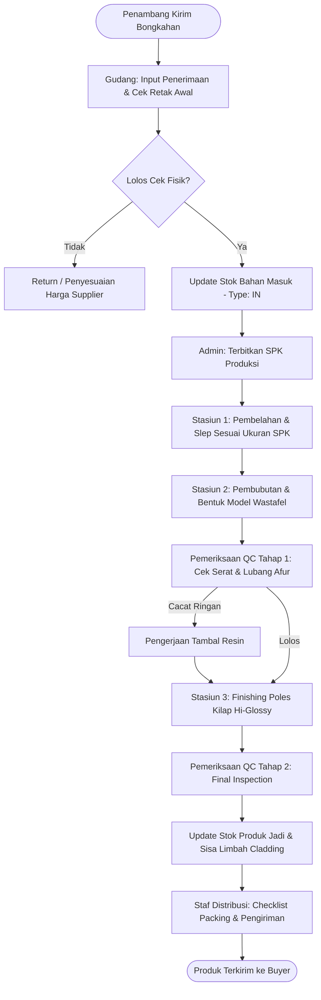

# SPESIFIKASI DESAIN SISTEM (DESIGN.md)
## Sistem Informasi E-Supply Chain Management Klaster IKM Marmer Tulungagung

Dokumen ini menggabungkan seluruh spesifikasi teknis dan bisnis (*Product Requirement Document*, Arsitektur Sistem, Basis Data, Spesifikasi API, *User Flow*, dan Integrasi *Forecasting*).

---

## 1. Latar Belakang, Temuan Lapangan & Metrik Sukses

### 1.1 Masalah dan Kesenjangan Informasi (*Information Gap*)
Berdasarkan studi empiris di klaster pengrajin marmer Kabupaten Tulungagung (studi kasus **UD Cahaya Onix** dan **UD Putra Abadi**), ditemukan sejumlah pemborosan (*lean waste*) dan kendala aliran informasi konvensional:

1. **Penerimaan & Gudang Bahan Baku:**
   - Tidak adanya pencatatan riwayat pengadaan dan data spesifikasi blok batu secara digital.
   - Dampak: Pemeriksaan fisik berulang (*waiting & overprocessing*), batu retak/cacat baru terdeteksi di mesin bubut (*defect/scrap*).
2. **Lantai Produksi (Work in Progress):**
   - Rincian ukuran dan Surat Perintah Kerja (SPK) tidak terdistribusi tertulis ke stasiun bubut/slep.
   - Ketiadaan pencatatan sisa potongan marmer/batu kali (cladding/stepping stone).
   - Dampak: Variasi hasil antaroperator, waktu penyesuaian berulang, penumpukan limbah tak terdata (390 menit/minggu di UD Putra Abadi).
3. **Quality Control (QC):**
   - QC bersifat reaktif di tahap akhir, menyebabkan tingginya biaya penambalan resin/katalis dan pengerjaan ulang (*rework*).
4. **Distribusi & Pesanan:**
   - Status kesiapan barang jadi tidak terhubung secara *real-time* ke bagian penjualan/ekspedisi.

### 1.2 Baseline Value Stream Mapping (VSM Current State)
- **UD Cahaya Onix (Produksi Wastafel Marmer & Onix, 14 unit/hari):**
  - Total Cycle Time: **480 menit** (8 jam kerja).
  - Value-Added (VA) Time: **310 menit** (64,58%).
  - Non-Value-Added (NVA) Time: **170 menit** (35,42%).
  - Process Cycle Efficiency (PCE): **64,58%** (Peluang perbaikan utama: pembelahan manual 60 menit & handling/limbah 60 menit).
- **UD Putra Abadi:**
  - Total waktu handling limbah tak terstruktur: **390 menit/minggu** (aktivitas terbesar: pemeriksaan ulang sisa potongan 70 menit, pengangkutan 60 menit).

### 1.3 Target Metrik Sukses & KPI (Konvensional vs Digital)
| Indikator Kinerja (KPI) | Kondisi Konvensional (Baseline) | Target Setelah Implementasi E-SCM | Metode Pengukuran |
| :--- | :--- | :--- | :--- |
| **Lead Time Produksi-Distribusi** | 480 menit/siklus | Turun $\ge 20\%$ ($\le 384$ menit) | Time-tracking modul produksi |
| **Akurasi Pencatatan Stok** | $\approx 65-70\%$ (sering selisih fisik) | $\ge 95\%$ | Audit stok berkala vs sistem |
| **Waktu Pencarian Informasi/Stok** | 15–30 menit/transaksi | $< 2$ menit (instan via search) | Log durasi akses sistem |
| **Defect/Rework Rate** | $\approx 18-25\%$ produk perlu tambal | Turun hingga $< 8\%$ | Log inspeksi QC tahap 1 & 2 |
| **Process Cycle Efficiency (PCE)** | $64,58\%$ | Naik ke $\ge 80\%$ | Formula VSM: $\frac{\text{VA Time}}{\text{Total Time}} \times 100\%$ |

---

## 2. Persona & User Stories

### 2.1 Persona Pengguna
1. **Pak Joko (48 tahun) - Pemilik / Manajer IKM Marmer**
   - *Karakteristik:* Literasi digital menengah-rendah, menggunakan smartphone Android.
   - *Kebutuhan:* Memantau stok bahan mentah & produk jadi, memonitor progres pesanan pelanggan, melihat grafik peramalan kebutuhan bahan baku bulan depan tanpa repot membuka pembukuan manual.
2. **Mas Budi (32 tahun) - Kepala Gudang & Bahan Baku**
   - *Karakteristik:* Terbiasa input cepat di HP/tablet/laptop gudang.
   - *Kebutuhan:* Mencatat penerimaan bongkahan batu dari penambang, mencatat nomor batch/grade batu, mengecek stok minimum, mengeluarkan material ke produksi.
3. **Pak Slamet (42 tahun) - Operator Bubut / Mandor Produksi**
   - *Karakteristik:* Bekerja di lantai bengkel bubut marmer, butuh tampilan sederhana & tombol besar.
   - *Kebutuhan:* Melihat antrean SPK (dimensi potongan, model wastafel), mengupdate status stasiun (Potong $\rightarrow$ Bubut $\rightarrow$ Poles $\rightarrow$ QC), mencatat sisa potongan/limbah.
4. **Mbak Rini (27 tahun) - Staf Distribusi & Penjualan**
   - *Karakteristik:* Mengelola order pelanggan luar kota/ekspor.
   - *Kebutuhan:* Mengetahui stok produk jadi yang siap kirim (*ready-to-ship*), checklist packing pengiriman, dan cetak surat jalan / invoice.

---

## 3. Prioritas Fitur (Metode MoSCoW)

### 3.1 Must Have (Wajib Ada di MVP)
- **Autentikasi & RBAC:** Login aman multi-peran (Admin/Owner, Gudang, Produksi, Distribusi).
- **Modul Manajemen Stok Bahan Baku & Produk Jadi:** CRUD master barang, kategori, satuan, pencatatan transaksi masuk (In), keluar (Out), penyesuaian awal (Opening), dan titipan (Consign).
- **Notifikasi Stok Minimum (*Low Stock Alert*):** Indikator visual otomatis saat kuantitas batu/bahan baku di bawah batas aman.
- **Modul SPK & Tracking Produksi Bertahap:** Pembuatan Work Order, assign ke stasiun kerja, perubahan status (Pending, In-Progress, QC Passed, Completed).
- **Dashboard Monitoring Utama:** Visualisasi Card KPI transaksi, Pie Chart komposisi stok, Column Chart per gudang, dan Line Chart tren bulanan.

### 3.2 Should Have (Sangat Penting)
- **Integrasi Algoritma Forecasting:** Prediksi kebutuhan bahan baku & permintaan produk periode mendatang (metode *Moving Average* & *Holt-Winters Exponential Smoothing*) via REST API microservice.
- **Log Inspeksi QC 2-Tahap:** Pencatatan hasil uji fisik awal (sebelum bubut) dan uji akhir (kehalusan/kebocoran lubang afur).
- **Pencatatan Limbah & Sisa Potongan:** Klasifikasi sisa marmer (bisa diolah jadi stepping stone/cladding vs limbah urukan).
- **Laporan & Ekspor:** Cetak surat jalan, kartu stok, dan ekspor data ke Excel/PDF.

### 3.3 Could Have (Fitur Tambahan)
- **Modul Peramalan Lanjutan (ARIMA/SARIMA):** Model time-series musiman untuk lonjakan pesanan proyek hari raya/arsitektur.
- **Pindai Barcode / QR Code:** Labeling QR code pada palet/krat wastafel marmer untuk verifikasi packing cepat.
- **Integrasi WhatsApp Notification:** Notifikasi otomatis ke nomor pemilik/supplier saat stok bahan menipis.

### 3.4 Won't Have (Di Luar Cakupan Saat Ini)
- Sistem pembayaran online (*payment gateway*) langsung dalam aplikasi.
- Pelacakan armada truk distribusi via GPS *real-time*.

---

## 4. Arsitektur Sistem & Teknologi

### 4.1 Diagram Arsitektur Aplikasi
```
+-------------------------------------------------------------+
|                      Client Layer                           |
|       (Desktop Browser, Tablet, Mobile Android Browser)     |
+-------------------------------------------------------------+
                              | HTTPS
                              v
+-------------------------------------------------------------+
|              Web Application Layer (Laravel 10 MVC)         |
|  - Routing & Middleware (Auth, RBAC Role Check)             |
|  - Controllers (StockController, ProductionController, etc) |
|  - Services (InventoryService, SPKService, ChartService)    |
|  - Views (Blade Templates + Bootstrap 5 + ApexCharts/ChartJS)|
+-------------------------------------------------------------+
             |                                    |
             | Eloquent ORM                       | HTTP JSON REST API
             v                                    v
+------------------------+      +-----------------------------+
|  Database Layer        |      |  Forecasting Microservice   |
|  (MySQL 8.0 / MariaDB) |      |  (Python 3.10 + FastAPI)    |
|  - Materials & Stocks  |      |  - Statsmodels / Sklearn    |
|  - Work Orders & Steps |      |  - Moving Avg & Exp Smooth  |
|  - Transactions & Logs |      |  - Model Evaluation (MAPE)  |
+------------------------+      +-----------------------------+
```

---

## 5. Perancangan Basis Data (ERD & Kamus Data)

### 5.1 Skema Relasi Antar-Entitas (ERD)
- `users` (1) $\longleftrightarrow$ (M) `stock_transactions`
- `users` (1) $\longleftrightarrow$ (M) `work_orders`
- `categories` (1) $\longleftrightarrow$ (M) `products`
- `suppliers` (1) $\longleftrightarrow$ (M) `materials`
- `materials` (1) $\longleftrightarrow$ (M) `stock_transactions`
- `materials` (1) $\longleftrightarrow$ (M) `production_material_usages`
- `products` (1) $\longleftrightarrow$ (M) `work_orders`
- `work_orders` (1) $\longleftrightarrow$ (M) `production_steps`
- `work_orders` (1) $\longleftrightarrow$ (M) `qc_logs`
- `work_orders` (1) $\longleftrightarrow$ (M) `waste_logs`
- `customers` (1) $\longleftrightarrow$ (M) `shipments`
- `work_orders` (1) $\longleftrightarrow$ (M) `shipment_items`

### 5.2 Kamus Data Tabel Utama

#### 1. Tabel `users`
| Kolom | Tipe Data | Keterangan |
| :--- | :--- | :--- |
| `id` | BIGINT UNSIGNED (PK) | Auto Increment |
| `name` | VARCHAR(100) | Nama lengkap user |
| `email` | VARCHAR(100) (UNIQUE)| Alamat email / username login |
| `password` | VARCHAR(255) | Hash bcrypt |
| `role` | ENUM | `'admin'`, `'owner'`, `'gudang'`, `'produksi'`, `'distribusi'` |
| `phone` | VARCHAR(20) | Nomor WhatsApp |
| `created_at` / `updated_at` | TIMESTAMP | Audit trail |

#### 2. Tabel `materials` (Bahan Baku Mentah Marmer & Onyx)
| Kolom | Tipe Data | Keterangan |
| :--- | :--- | :--- |
| `id` | BIGINT UNSIGNED (PK) | Auto Increment |
| `material_code` | VARCHAR(50) (UNIQUE) | Contoh: `MAT-MRM-001` |
| `name` | VARCHAR(150) | Misal: *Bongkahan Marmer Putih Campurdarat* |
| `type` | ENUM | `'marmer'`, `'onix'`, `'batu_kali'`, `'bahan_penolong'` |
| `grade` | VARCHAR(20) | Grade A (Super), Grade B, Grade C |
| `unit` | VARCHAR(20) | `'ton'`, `'m3'`, `'blok'`, `'sak'`, `'kg'` |
| `current_stock` | DECIMAL(12,2) | Sisa stok terkini |
| `minimum_stock` | DECIMAL(12,2) | Ambang batas alert stok minimum |
| `unit_cost` | DECIMAL(15,2) | Harga perolehan per satuan |

#### 3. Tabel `stock_transactions` (Aliran Material: Opening, In, Out, Consign)
| Kolom | Tipe Data | Keterangan |
| :--- | :--- | :--- |
| `id` | BIGINT UNSIGNED (PK) | Auto Increment |
| `transaction_code` | VARCHAR(50) (UNIQUE) | Nomor bukti transaksi |
| `material_id` | BIGINT UNSIGNED (FK) | Relasi ke `materials.id` |
| `user_id` | BIGINT UNSIGNED (FK) | Petugas yang mencatat |
| `type` | ENUM | `'opening'`, `'in'`, `'out'`, `'consign'` |
| `quantity` | DECIMAL(12,2) | Jumlah material |
| `reference_type` | VARCHAR(50) | `'purchase_order'`, `'work_order'`, `'adjustment'` |
| `reference_id` | BIGINT UNSIGNED | ID dokumen referensi |
| `notes` | TEXT | Catatan kondisi fisik batu / vendor |
| `transaction_date` | DATE | Tanggal transaksi |

#### 4. Tabel `products` (Katalog Produk Jadi)
| Kolom | Tipe Data | Keterangan |
| :--- | :--- | :--- |
| `id` | BIGINT UNSIGNED (PK) | Auto Increment |
| `product_code` | VARCHAR(50) (UNIQUE) | Misal: `PROD-WSF-01` |
| `category_id` | BIGINT UNSIGNED (FK) | Relasi kategori (Wastafel, Stepping Stone, dsb) |
| `name` | VARCHAR(150) | Nama produk (Wastafel Bulat D40 Marmer Bakar) |
| `dimension_spec` | VARCHAR(100) | Dimensi: D=40cm, T=15cm |
| `ready_stock` | INT | Jumlah stok barang jadi di gudang |
| `safety_stock` | INT | Batas stok aman |
| `selling_price` | DECIMAL(15,2) | Harga jual standar |

#### 5. Tabel `work_orders` (Surat Perintah Kerja Produksi)
| Kolom | Tipe Data | Keterangan |
| :--- | :--- | :--- |
| `id` | BIGINT UNSIGNED (PK) | Auto Increment |
| `spk_number` | VARCHAR(50) (UNIQUE) | Misal: `SPK/2026/04/001` |
| `product_id` | BIGINT UNSIGNED (FK) | Produk yang diproduksi |
| `target_quantity` | INT | Jumlah unit pesanan |
| `completed_quantity`| INT | Jumlah unit selesai lolos QC |
| `status` | ENUM | `'draft'`, `'scheduled'`, `'in_progress'`, `'qc_phase'`, `'completed'`, `'cancelled'` |
| `start_date` | DATE | Tanggal mulai produksi |
| `due_date` | DATE | Target selesai |

#### 6. Tabel `production_steps` (Tracking Tahapan Produksi)
| Kolom | Tipe Data | Keterangan |
| :--- | :--- | :--- |
| `id` | BIGINT UNSIGNED (PK) | Auto Increment |
| `work_order_id` | BIGINT UNSIGNED (FK) | Relasi ke `work_orders.id` |
| `step_name` | ENUM | `'pembelahan'`, `'pemotongan_slep'`, `'bubut_bentuk'`, `'poles_finishing'`, `'inspeksi_qc'` |
| `operator_id` | BIGINT UNSIGNED (FK) | Operator pelaksana |
| `machine_number` | VARCHAR(30) | Nomor mesin bubut/slep (1-7) |
| `duration_minutes` | INT | Durasi pengerjaan aktual |
| `status` | ENUM | `'pending'`, `'running'`, `'done'` |
| `notes` | TEXT | Catatan kendala mesin/batu |

#### 7. Tabel `qc_logs` (Pemeriksaan Kualitas Dua Tahap)
| Kolom | Tipe Data | Keterangan |
| :--- | :--- | :--- |
| `id` | BIGINT UNSIGNED (PK) | Auto Increment |
| `work_order_id` | BIGINT UNSIGNED (FK) | Relasi ke SPK |
| `stage` | ENUM | `'qc1_raw_shape'`, `'qc2_final_polish'` |
| `checked_quantity` | INT | Jumlah unit diperiksa |
| `pass_quantity` | INT | Jumlah unit lolos |
| `rework_quantity` | INT | Jumlah unit perlu perbaikan/tambal |
| `scrap_quantity` | INT | Jumlah unit cacat total |
| `defect_type` | VARCHAR(100) | Retak serat alam, lubang afur miring, permukaan buram |
| `inspector_id` | BIGINT UNSIGNED (FK) | Petugas QC |

#### 8. Tabel `waste_logs` (Pencatatan Limbah & Sisa Potongan)
| Kolom | Tipe Data | Keterangan |
| :--- | :--- | :--- |
| `id` | BIGINT UNSIGNED (PK) | Auto Increment |
| `work_order_id` | BIGINT UNSIGNED (FK) | Relasi SPK |
| `waste_type` | ENUM | `'sisa_layak_cladding'`, `'serbuk_bubut'`, `'bongkahan_urukan'` |
| `weight_or_volume` | DECIMAL(10,2) | Berat (kg) atau volume (m3) |
| `reuse_status` | ENUM | `'disimpan_daur_ulang'`, `'dijual_ke_pihak3'`, `'dibuang_ke_urukan'` |

---

## 6. Spesifikasi Antarmuka API (REST Endpoints)

### 6.1 Modul Bahan Baku & Transaksi Stok
- `GET /api/v1/materials` $\rightarrow$ Menampilkan daftar stok bahan baku + filter grade & status minimum stock.
- `POST /api/v1/materials` $\rightarrow$ Menambah master bahan baku baru.
- `POST /api/v1/stock/transactions` $\rightarrow$ Mencatat pergerakan stok (`in`, `out`, `opening`, `consign`).
- `GET /api/v1/stock/summary` $\rightarrow$ Mengembalikan data agregat untuk Card & Chart Dashboard.

### 6.2 Modul Produksi & SPK
- `GET /api/v1/work-orders` $\rightarrow$ Daftar SPK beserta status progres & stasiun kerja saat ini.
- `POST /api/v1/work-orders` $\rightarrow$ Menerbitkan SPK digital baru.
- `PATCH /api/v1/work-orders/{id}/step` $\rightarrow$ Mengupdate progres stasiun kerja (selesai bubut, lanjut ke poles).
- `POST /api/v1/qc/inspect` $\rightarrow$ Input hasil pemeriksaan QC tahap 1 atau tahap 2.

### 6.3 Endpoint Integrasi Forecasting (FastAPI Python)
- `POST /api/forecast/predict`
  - **Payload Request:**
    ```json
    {
      "item_type": "material",
      "item_id": 1,
      "historical_months": 12,
      "forecast_horizon": 3,
      "algorithm": "holt_winters"
    }
    ```
  - **Response:**
    ```json
    {
      "status": "success",
      "model_used": "Holt-Winters Exponential Smoothing",
      "metrics": {
        "mape": 6.42,
        "rmse": 1.15
      },
      "predictions": [
        {"period": "2026-09", "predicted_qty": 420.5, "lower_bound": 395.0, "upper_bound": 446.0},
        {"period": "2026-10", "predicted_qty": 435.0, "lower_bound": 402.0, "upper_bound": 468.0},
        {"period": "2026-11", "predicted_qty": 460.2, "lower_bound": 421.0, "upper_bound": 499.4}
      ]
    }
    ```

---

## 7. Alur Pengguna (User Flow & Business Logic)



---

## 8. Logika Algoritma Forecasting & Pengujian Akurasi

### 8.1 Model yang Diimplementasikan
1. **Single Moving Average (SMA - $k=3$):** Baseline pembanding tercepat.
   $$F_{t+1} = \frac{1}{k} \sum_{i=0}^{k-1} A_{t-i}$$
2. **Holt-Winters Exponential Smoothing (Level, Trend, & Multiplicative/Additive Seasonality):** Untuk menangani tren pertumbuhan dan fluktuasi pesanan.
3. **ARIMA $(p, d, q)$:** Untuk analisis deret waktu stasioner dengan data historis panjang ($\ge 24$ bulan).

### 8.2 Metrik Evaluasi Performa Model
- **Mean Absolute Percentage Error (MAPE):**
  $$\text{MAPE} = \frac{1}{n} \sum_{t=1}^{n} \left| \frac{A_t - F_t}{A_t} \right| \times 100\%$$
  *(Target akurasi: $\text{MAPE} < 10\%$ = Sangat Akurat).*
- **Root Mean Squared Error (RMSE):**
  $$\text{RMSE} = \sqrt{\frac{1}{n} \sum_{t=1}^{n} (A_t - F_t)^2}$$
