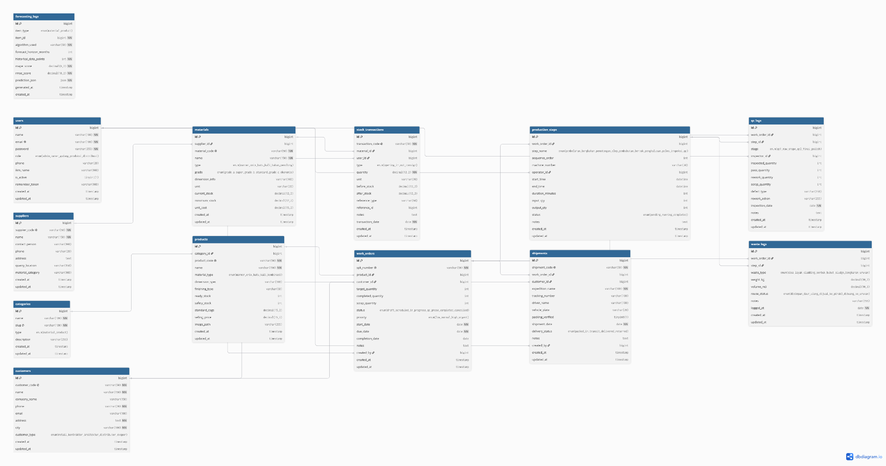

# DOKUMEN OUTPUT KEGIATAN 4
## Desain Arsitektur Basis Data Relasional & Skema Integrasi Antarmodul
**Proyek:** Rancang Bangun Sistem Informasi E-Supply Chain Terintegrasi untuk Akselerasi Hilirisasi Klaster IKM Marmer di Kabupaten Tulungagung  
**Mitra Studi Kasus:** UD Cahaya Onix & UD Putra Abadi (Kabupaten Tulungagung)  
**Metodologi SDLC:** Tahap Perancangan Sistem (*System Design & Data Architecture*)

---

## 1. Tujuan Kegiatan
Kegiatan ini bertujuan untuk merancang struktur basis data relasional ternormalisasi (1NF–3NF) yang kokoh, konsisten, dan bebas redundansi sebagai tulang punggung sistem E-SCM klaster marmer. Rancangan ini mengintegrasikan seluruh entitas data operasional (pemasok tambang, bahan mentah, lantai produksi bertahap, kendali mutu QC 2-tahap, limbah, produk jadi, pengiriman, serta log peramalan) dan menetapkan skema pertukaran data antarmodul secara *real-time*.

---

## 2. Diagram Hubungan Entitas (Entity Relationship Diagram - ERD)

Berikut adalah rancangan diagram hubungan entitas relasional (*Entity Relationship Diagram*) yang mengintegrasikan seluruh alur operasional rantai pasok marmer dari hulu (pemasok tambang & bahan baku), lantai produksi (SPK, tahapan stasiun mesin, kendali mutu QC 2-tahap, dan pengelolaan limbah), hingga hilir (produk jadi, pelanggan, pengiriman surat jalan, serta log peramalan AI):

**Gambar 1. Entity Relationship Diagram (ERD) Sistem E-Supply Chain**

---

## 3. Proses Normalisasi Data (1NF $\rightarrow$ 2NF $\rightarrow$ 3NF)

Untuk memastikan integritas referensial dan menghilangkan anomali *insert*, *update*, maupun *delete*, dilakukan tiga tahap normalisasi:

1. **Bentuk Normal Pertama (1NF):**
   - *Eliminasi Repeating Group:* Semua atribut bernilai atomik tunggal. Struktur pesanan yang awalnya memuat multi-tahap produksi dipecah menjadi entitas terpisah (`work_orders` dan `production_steps`).
   - *Primary Key:* Setiap entitas didefinisikan dengan Primary Key (`id`) bertipe `BIGINT UNSIGNED AUTO_INCREMENT`.

2. **Bentuk Normal Kedua (2NF):**
   - *Eliminasi Ketergantungan Parsial:* Seluruh atribut non-kunci bergantung penuh pada *primary key*. Data pelanggan (`customers`), pemasok tambang (`suppliers`), dan kategori produk (`categories`) dipisahkan dari tabel transaksi agar tidak terduplikasi saat terjadi transaksi berulang.

3. **Bentuk Normal Ketiga (3NF):**
   - *Eliminasi Ketergantungan Transitif:* Tidak ada atribut non-kunci yang bergantung pada atribut non-kunci lainnya. Sebagai contoh, data nama pemasok dan lokasi tambang tidak disimpan di tabel `materials`, melainkan dihubungkan via `supplier_id` (Foreign Key). Begitu juga hasil pengujian QC dipisahkan ke `qc_logs`.

---

## 4. Form 4.1: Kamus Data Lengkap (Data Dictionary)

Berikut adalah spesifikasi detail seluruh tabel dalam skema basis data `db_escm_marmer`:

### 4.1 Tabel `users` (Manajemen Pengguna & Hak Akses)
| No | Nama Kolom | Tipe Data | Panjang / Format | Constraint | Relasi | Keterangan |
| :--- | :--- | :--- | :--- | :--- | :--- | :--- |
| 1 | `id` | BIGINT UNSIGNED | - | PK, Auto Increment | - | ID unik pengguna |
| 2 | `name` | VARCHAR | 100 | NOT NULL | - | Nama lengkap petugas |
| 3 | `email` | VARCHAR | 100 | NOT NULL, UNIQUE | - | Email login |
| 4 | `password` | VARCHAR | 255 | NOT NULL | - | Hash Bcrypt password |
| 5 | `role` | ENUM | 'admin','owner','gudang','produksi','distribusi' | NOT NULL | - | Peran hak akses sistem |
| 6 | `phone` | VARCHAR | 20 | NULL | - | Nomor WhatsApp |
| 7 | `ikm_name` | VARCHAR | 100 | NOT NULL | - | Nama unit usaha IKM mitra |
| 8 | `is_active` | TINYINT | 1 | NOT NULL, Default: 1 | - | Status keaktifan akun |
| 9 | `created_at` | TIMESTAMP | - | NULL | - | Waktu pembuatan akun |
| 10 | `updated_at` | TIMESTAMP | - | NULL | - | Waktu perubahan terakhir |

### 4.2 Tabel `suppliers` (Pemasok Tambang Bahan Baku)
| No | Nama Kolom | Tipe Data | Panjang / Format | Constraint | Relasi | Keterangan |
| :--- | :--- | :--- | :--- | :--- | :--- | :--- |
| 1 | `id` | BIGINT UNSIGNED | - | PK, Auto Increment | - | ID unik pemasok |
| 2 | `supplier_code` | VARCHAR | 50 | NOT NULL, UNIQUE | - | Kode pemasok (SUP-xxx) |
| 3 | `name` | VARCHAR | 150 | NOT NULL | - | Nama tambang / pemilik |
| 4 | `contact_person` | VARCHAR | 100 | NULL | - | Kontak penanggung jawab |
| 5 | `phone` | VARCHAR | 20 | NULL | - | No. telepon/WA |
| 6 | `address` | TEXT | - | NULL | - | Alamat kantor/tambang |
| 7 | `quarry_location` | VARCHAR | 150 | NULL | - | Lokasi bukit (Besole/Campurdarat) |
| 8 | `material_category` | VARCHAR | 100 | NULL | - | Jenis batu yang dihasilkan |

### 4.3 Tabel `materials` (Master Bahan Baku Bongkahan)
| No | Nama Kolom | Tipe Data | Panjang / Format | Constraint | Relasi | Keterangan |
| :--- | :--- | :--- | :--- | :--- | :--- | :--- |
| 1 | `id` | BIGINT UNSIGNED | - | PK, Auto Increment | - | ID unik bahan baku |
| 2 | `supplier_id` | BIGINT UNSIGNED | - | NULL | FK $\rightarrow$ `suppliers.id` | ID penambang pemasok |
| 3 | `material_code` | VARCHAR | 50 | NOT NULL, UNIQUE | - | Kode bahan (MAT-xxx) |
| 4 | `name` | VARCHAR | 150 | NOT NULL | - | Nama varian bahan marmer/onyx |
| 5 | `type` | ENUM | 'marmer','onix','batu_kali','bahan_penolong' | NOT NULL | - | Klasifikasi batuan alam |
| 6 | `grade` | ENUM | 'grade_a_super','grade_b_standard','grade_c_ekonomis' | NOT NULL | - | Tingkat kualitas serat & kekerasan |
| 7 | `dimension_info` | VARCHAR | 100 | NULL | - | Dimensi blok (PxLxT cm) |
| 8 | `unit` | VARCHAR | 20 | NOT NULL | - | Satuan ('blok', 'ton', 'kg') |
| 9 | `current_stock` | DECIMAL | 12,2 | NOT NULL, Default: 0 | - | Sisa fisik stok di gudang |
| 10 | `minimum_stock` | DECIMAL | 12,2 | NOT NULL, Default: 5 | - | Ambang batas alert peringatan |
| 11 | `unit_cost` | DECIMAL | 15,2 | NOT NULL, Default: 0 | - | Harga beli per satuan (Rp) |

### 4.4 Tabel `stock_transactions` (Log Mutasi Aliran Bahan Baku)
| No | Nama Kolom | Tipe Data | Panjang / Format | Constraint | Relasi | Keterangan |
| :--- | :--- | :--- | :--- | :--- | :--- | :--- |
| 1 | `id` | BIGINT UNSIGNED | - | PK, Auto Increment | - | ID transaksi stok |
| 2 | `transaction_code` | VARCHAR | 50 | NOT NULL, UNIQUE | - | No. Transaksi (TRX-xxx) |
| 3 | `material_id` | BIGINT UNSIGNED | - | NOT NULL | FK $\rightarrow$ `materials.id` | Bahan yang mengalami mutasi |
| 4 | `user_id` | BIGINT UNSIGNED | - | NOT NULL | FK $\rightarrow$ `users.id` | Petugas pencatat mutasi |
| 5 | `type` | ENUM | 'opening','in','out','consign' | NOT NULL | - | Jenis transaksi aliran material |
| 6 | `quantity` | DECIMAL | 12,2 | NOT NULL | - | Jumlah unit batu masuk/keluar |
| 7 | `unit` | VARCHAR | 20 | NOT NULL, Default: 'blok' | - | Satuan unit mutasi ('blok','biji','ton') |
| 8 | `before_stock` | DECIMAL | 12,2 | NOT NULL, Default: 0 | - | Posisi stok sebelum transaksi |
| 9 | `after_stock` | DECIMAL | 12,2 | NOT NULL, Default: 0 | - | Posisi stok sesudah transaksi |
| 10 | `reference_type` | VARCHAR | 50 | NULL | - | Dokumen rujukan (surat_jalan_tambang, spk) |
| 11 | `reference_id` | BIGINT UNSIGNED | - | NULL | - | ID entitas dokumen rujukan terkait |
| 12 | `notes` | TEXT | - | NULL | - | Catatan kondisi fisik batu |
| 13 | `transaction_date`| DATE | - | NOT NULL | - | Tanggal mutasi fisik |
| 14 | `created_at` | TIMESTAMP | - | NULL | - | Waktu pembuatan transaksi |
| 15 | `updated_at` | TIMESTAMP | - | NULL | - | Waktu perubahan transaksi |

### 4.5 Tabel `products` (Katalog Produk Jadi)
| No | Nama Kolom | Tipe Data | Panjang / Format | Constraint | Relasi | Keterangan |
| :--- | :--- | :--- | :--- | :--- | :--- | :--- |
| 1 | `id` | BIGINT UNSIGNED | - | PK, Auto Increment | - | ID unik produk |
| 2 | `category_id` | BIGINT UNSIGNED | - | NOT NULL | FK $\rightarrow$ `categories.id` | Kategori produk |
| 3 | `product_code` | VARCHAR | 50 | NOT NULL, UNIQUE | - | Kode barang jadi (PRD-xxx) |
| 4 | `name` | VARCHAR | 150 | NOT NULL | - | Nama produk (Wastafel Bakar D40) |
| 5 | `material_type` | ENUM | 'marmer','onix','batu_kali','kombinasi' | NOT NULL | - | Jenis batuan dominan |
| 6 | `dimension_spec` | VARCHAR | 100 | NULL | - | Spesifikasi ukuran (D, T, P, L) |
| 7 | `finishing_type` | VARCHAR | 50 | NOT NULL, Default: 'Hi-Glossy' | - | Poles Hi-Glossy / Doff / Alami |
| 8 | `ready_stock` | INT | - | NOT NULL, Default: 0 | - | Stok produk jadi siap kirim |
| 9 | `safety_stock` | INT | - | NOT NULL, Default: 5 | - | Batas aman stok barang jadi |
| 10 | `standard_cogs` | DECIMAL | 15,2 | NOT NULL, Default: 0 | - | HPP Standar produksi (Rp) |
| 11 | `selling_price` | DECIMAL | 15,2 | NOT NULL, Default: 0 | - | Harga jual ke pelanggan (Rp) |
| 12 | `image_path` | VARCHAR | 255 | NULL | - | Path foto katalog produk |

### 4.6 Tabel `work_orders` (Surat Perintah Kerja Produksi Digital)
| No | Nama Kolom | Tipe Data | Panjang / Format | Constraint | Relasi | Keterangan |
| :--- | :--- | :--- | :--- | :--- | :--- | :--- |
| 1 | `id` | BIGINT UNSIGNED | - | PK, Auto Increment | - | ID unik SPK |
| 2 | `spk_number` | VARCHAR | 50 | NOT NULL, UNIQUE | - | Nomor resmi SPK digital |
| 3 | `product_id` | BIGINT UNSIGNED | - | NOT NULL | FK $\rightarrow$ `products.id` | Target produk yang dibikin |
| 4 | `customer_id` | BIGINT UNSIGNED | - | NULL | FK $\rightarrow$ `customers.id` | Pemesan (jika pesanan khusus) |
| 5 | `target_quantity` | INT | - | NOT NULL, Default: 1 | - | Jumlah unit target |
| 6 | `completed_quantity`| INT | - | NOT NULL, Default: 0 | - | Jumlah unit lolos QC akhir |
| 7 | `scrap_quantity` | INT | - | NOT NULL, Default: 0 | - | Jumlah unit rusak/afkir |
| 8 | `status` | ENUM | 'draft','scheduled','in_progress','qc_phase','completed','cancelled' | NOT NULL | - | Status tahapan pengerjaan |
| 9 | `priority` | ENUM | 'low','normal','high','urgent' | NOT NULL, Default: 'normal' | Prioritas pengerjaan mesin |
| 10 | `start_date` | DATE | - | NOT NULL | - | Tanggal mulai produksi |
| 11 | `due_date` | DATE | - | NOT NULL | - | Batas waktu penyelesaian |
| 12 | `completion_date` | DATE | - | NULL | - | Tanggal penyelesaian aktual |
| 13 | `notes` | TEXT | - | NULL | - | Catatan instruksi kerja |
| 14 | `created_by` | BIGINT UNSIGNED | - | NOT NULL | FK $\rightarrow$ `users.id` | Petugas pembuat SPK |

### 4.7 Tabel `production_steps` (Tracking Tahapan Stasiun Kerja)
| No | Nama Kolom | Tipe Data | Panjang / Format | Constraint | Relasi | Keterangan |
| :--- | :--- | :--- | :--- | :--- | :--- | :--- |
| 1 | `id` | BIGINT UNSIGNED | - | PK, Auto Increment | - | ID tahapan kerja |
| 2 | `work_order_id` | BIGINT UNSIGNED | - | NOT NULL | FK $\rightarrow$ `work_orders.id` | SPK induk |
| 3 | `step_name` | ENUM | 'pembelahan_bongkahan','pemotongan_slep','pembubutan_bentuk','penghalusan_poles','inspeksi_qc' | NOT NULL | - | Nama stasiun kerja |
| 4 | `sequence_order` | INT | - | NOT NULL, Default: 1 | - | Urutan stasiun (1 s.d 5) |
| 5 | `machine_number` | VARCHAR | 30 | NULL | - | Nomor mesin bubut/slep (1-7) |
| 6 | `operator_id` | BIGINT UNSIGNED | - | NULL | FK $\rightarrow$ `users.id` | Operator yang mengerjakan |
| 7 | `start_time` | DATETIME | - | NULL | - | Waktu mulai proses stasiun |
| 8 | `end_time` | DATETIME | - | NULL | - | Waktu selesai proses stasiun |
| 9 | `duration_minutes`| INT | - | NOT NULL, Default: 0 | - | Durasi kerja aktual (menit) |
| 10 | `input_qty` | INT | - | NOT NULL, Default: 0 | - | Unit masuk stasiun |
| 11 | `output_qty` | INT | - | NOT NULL, Default: 0 | - | Unit berhasil diproses |
| 12 | `status` | ENUM | 'pending','running','completed' | NOT NULL, Default: 'pending' | Status pengerjaan stasiun |
| 13 | `notes` | TEXT | - | NULL | - | Catatan hambatan mesin/operator |

### 4.8 Tabel `qc_logs` (Pemeriksaan Kualitas Dua Tahap)
| No | Nama Kolom | Tipe Data | Panjang / Format | Constraint | Relasi | Keterangan |
| :--- | :--- | :--- | :--- | :--- | :--- | :--- |
| 1 | `id` | BIGINT UNSIGNED | - | PK, Auto Increment | - | ID inspeksi QC |
| 2 | `work_order_id` | BIGINT UNSIGNED | - | NOT NULL | FK $\rightarrow$ `work_orders.id` | SPK terkait |
| 3 | `step_id` | BIGINT UNSIGNED | - | NULL | FK $\rightarrow$ `production_steps.id` | Stasiun kerja terkait |
| 4 | `stage` | ENUM | 'qc1_raw_shape','qc2_final_polish' | NOT NULL | - | Tahap 1 (Bentuk) / Tahap 2 (Poles) |
| 5 | `inspector_id` | BIGINT UNSIGNED | - | NOT NULL | FK $\rightarrow$ `users.id` | Petugas pemeriksa |
| 6 | `inspected_quantity`| INT | - | NOT NULL, Default: 0 | - | Jumlah unit diperiksa |
| 7 | `pass_quantity` | INT | - | NOT NULL, Default: 0 | - | Jumlah unit lolos standar |
| 8 | `rework_quantity`| INT | - | NOT NULL, Default: 0 | - | Jumlah unit perlu tambal resin |
| 9 | `scrap_quantity` | INT | - | NOT NULL, Default: 0 | - | Jumlah unit retak total |
| 10 | `defect_type` | VARCHAR | 150 | NULL | - | Retak serat alam, lubang afur miring, dll |
| 11 | `rework_action` | VARCHAR | 255 | NULL | - | Tambal resin / poles ulang / potong ulang |
| 12 | `inspection_date`| DATE | - | NOT NULL | - | Tanggal inspeksi |
| 13 | `notes` | TEXT | - | NULL | - | Catatan teknis pengujian |

### 4.9 Tabel `waste_logs` (Pencatatan Limbah & Sisa Potongan Marmer)
| No | Nama Kolom | Tipe Data | Panjang / Format | Constraint | Relasi | Keterangan |
| :--- | :--- | :--- | :--- | :--- | :--- | :--- |
| 1 | `id` | BIGINT UNSIGNED | - | PK, Auto Increment | - | ID pencatatan residu |
| 2 | `work_order_id` | BIGINT UNSIGNED | - | NOT NULL | FK $\rightarrow$ `work_orders.id` | SPK asal pemotongan |
| 3 | `step_id` | BIGINT UNSIGNED | - | NULL | FK $\rightarrow$ `production_steps.id` | Stasiun pemotong/slep |
| 4 | `waste_type` | ENUM | 'sisa_layak_cladding','serbuk_bubut_sludge','bongkahan_urukan' | NOT NULL | - | Klasifikasi limbah marmer |
| 5 | `weight_kg` | DECIMAL | 10,2 | NOT NULL, Default: 0.00 | - | Berat residu (kg) |
| 6 | `volume_m3` | DECIMAL | 10,3 | NULL, Default: 0.000 | - | Estimasi volume lumpur/sisa ($m^3$) |
| 7 | `reuse_status` | ENUM | 'disimpan_daur_ulang','dijual_ke_pihak3','dibuang_ke_urukan' | NOT NULL, Default: 'disimpan_daur_ulang' | - | Pemanfaatan hilirisasi limbah |
| 8 | `notes` | VARCHAR | 255 | NULL | - | Catatan observasi penanganan residu |
| 9 | `logged_at` | DATE | - | NOT NULL | - | Tanggal pencatatan |

### 4.10 Tabel `shipments` (Pengiriman & Verifikasi Packing)
| No | Nama Kolom | Tipe Data | Panjang / Format | Constraint | Relasi | Keterangan |
| :--- | :--- | :--- | :--- | :--- | :--- | :--- |
| 1 | `id` | BIGINT UNSIGNED | - | PK, Auto Increment | - | ID pengiriman |
| 2 | `shipment_code` | VARCHAR | 50 | NOT NULL, UNIQUE | - | Nomor Surat Jalan (SJ-xxx) |
| 3 | `work_order_id` | BIGINT UNSIGNED | - | NULL | FK $\rightarrow$ `work_orders.id` | Pesanan SPK terkait |
| 4 | `customer_id` | BIGINT UNSIGNED | - | NOT NULL | FK $\rightarrow$ `customers.id` | Pelanggan penerima |
| 5 | `expedition_name`| VARCHAR | 100 | NOT NULL | - | Nama ekspedisi / armada kargo |
| 6 | `tracking_number`| VARCHAR | 100 | NULL | - | Nomor resi / AWB ekspedisi |
| 7 | `driver_name` | VARCHAR | 100 | NULL | - | Nama pengemudi truk |
| 8 | `vehicle_plate` | VARCHAR | 20 | NULL | - | Nomor plat kendaraan pengangkut |
| 9 | `packing_verified`| TINYINT | 1 | NOT NULL, Default: 0 | - | Checklist packing krat kayu (1 = lolos) |
| 10 | `shipment_date` | DATE | - | NOT NULL | - | Tanggal keberangkatan kargo |
| 11 | `delivery_status`| ENUM | 'packed','in_transit','delivered','returned' | NOT NULL, Default: 'packed' | - | Status perjalanan logistik |
| 12 | `notes` | TEXT | - | NULL | - | Catatan instruksi pengantaran |
| 13 | `created_by` | BIGINT UNSIGNED | - | NOT NULL | FK $\rightarrow$ `users.id` | Petugas pembuat surat jalan |

### 4.11 Tabel `forecasting_logs` (Histori Eksekusi Algoritma Peramalan)
| No | Nama Kolom | Tipe Data | Panjang / Format | Constraint | Relasi | Keterangan |
| :--- | :--- | :--- | :--- | :--- | :--- | :--- |
| 1 | `id` | BIGINT UNSIGNED | - | PK, Auto Increment | - | ID log prediksi |
| 2 | `item_type` | ENUM | 'material','product' | NOT NULL | - | Objek yang diprediksi |
| 3 | `item_id` | BIGINT UNSIGNED | - | NOT NULL | - | ID bahan baku / produk |
| 4 | `algorithm_used`| VARCHAR | 50 | NOT NULL | - | Model: Holt-Winters / Moving Average / ARIMA |
| 5 | `forecast_horizon_months` | INT | - | NOT NULL, Default: 3 | - | Rentang proyeksi bulan ke depan |
| 6 | `historical_data_points` | INT | - | NOT NULL | - | Jumlah sampel data deret waktu historis |
| 7 | `mape_score` | DECIMAL | 6,2 | NOT NULL | - | Skor Mean Absolute Percentage Error (%) |
| 8 | `rmse_score` | DECIMAL | 10,2 | NOT NULL | - | Skor Root Mean Square Error |
| 9 | `prediction_json`| JSON | - | NOT NULL | - | Struktur JSON hasil proyeksi deret waktu |
| 10 | `generated_at` | TIMESTAMP | - | NULL | - | Waktu komputasi algoritma |
| 11 | `created_at` | TIMESTAMP | - | NULL | - | Waktu penyimpanan log ke database |

### 4.12 Tabel `categories` (Master Kategori Produk & Bahan)
| No | Nama Kolom | Tipe Data | Panjang / Format | Constraint | Relasi | Keterangan |
| :--- | :--- | :--- | :--- | :--- | :--- | :--- |
| 1 | `id` | BIGINT UNSIGNED | - | PK, Auto Increment | - | ID unik kategori |
| 2 | `name` | VARCHAR | 100 | NOT NULL | - | Nama kategori (Wastafel, Stepping, Bahan) |
| 3 | `slug` | VARCHAR | 100 | NOT NULL, UNIQUE | - | Slug URL kategori |
| 4 | `type` | ENUM | 'material','product' | NOT NULL, Default: 'product' | - | Tipe kategori pengelompokan |
| 5 | `description` | VARCHAR | 255 | NULL | - | Deskripsi singkat kategori |
| 6 | `created_at` | TIMESTAMP | - | NULL | - | Waktu pembuatan kategori |
| 7 | `updated_at` | TIMESTAMP | - | NULL | - | Waktu perubahan terakhir |

### 4.13 Tabel `customers` (Master Pelanggan & Buyer Ekspor)
| No | Nama Kolom | Tipe Data | Panjang / Format | Constraint | Relasi | Keterangan |
| :--- | :--- | :--- | :--- | :--- | :--- | :--- |
| 1 | `id` | BIGINT UNSIGNED | - | PK, Auto Increment | - | ID unik pelanggan |
| 2 | `customer_code` | VARCHAR | 50 | NOT NULL, UNIQUE | - | Kode pelanggan (CUST-xxx) |
| 3 | `name` | VARCHAR | 150 | NOT NULL | - | Nama perorangan / pemilik toko |
| 4 | `company_name` | VARCHAR | 150 | NULL | - | Nama badan usaha / galeri seni |
| 5 | `phone` | VARCHAR | 20 | NOT NULL | - | Nomor telepon / WhatsApp buyer |
| 6 | `email` | VARCHAR | 100 | NULL | - | Email korespondensi |
| 7 | `address` | TEXT | - | NOT NULL | - | Alamat lengkap pengiriman |
| 8 | `city` | VARCHAR | 100 | NOT NULL | - | Kota tujuan (Denpasar, Surabaya, dll.) |
| 9 | `customer_type` | ENUM | 'retail','kontraktor_arsitektur','distributor_ekspor' | NOT NULL | - | Segmen buyer marmer |
| 10 | `created_at` | TIMESTAMP | - | NULL | - | Waktu pendaftaran buyer |
| 11 | `updated_at` | TIMESTAMP | - | NULL | - | Waktu perubahan terakhir |

---

## 5. Form 4.2: Mapping Integrasi Antar-Modul

Tabel berikut mendefinisikan mekanisme aliran data dan integrasi antarmodul dalam sistem:

| No | Modul Asal | Modul Tujuan | Data yang Ditransfer | Metode Integrasi | Frekuensi / Pemicu |
| :--- | :--- | :--- | :--- | :--- | :--- |
| **1** | **Gudang (Bahan Masuk)** | **Stok Bahan Baku** | Kuantitas batu masuk, grade, supplier, nomor blok | Shared Database (Transaction Commit) | *Real-time* saat form penerimaan disimpan |
| **2** | **Stok Bahan Baku** | **Modul Forecasting** | Data deret waktu pemakaian bulanan (12-24 bulan) | Internal REST API (HTTP POST JSON) | *On-Demand* saat jadwal peramalan dieksekusi |
| **3** | **Modul Forecasting** | **Perencanaan SPK & Gudang** | Rekomendasi kuantitas order batu periode depan & tingkat risiko | Internal REST API Response (JSON) $\rightarrow$ DB Sync | Otomatis tersimpan ke `forecasting_logs` |
| **4** | **Perencanaan Produksi** | **Lantai Produksi (Stasiun)** | No. SPK, spesifikasi ukuran wastafel, target unit, prioritas | Shared Database & Kanban Queue | Saat SPK berstatus `scheduled` / `in_progress` |
| **5** | **Lantai Produksi (Bubut/Slep)** | **Quality Control (QC 1 & 2)** | Unit siap uji, nomor mesin bubut, catatan serat | Shared Database (Trigger State Change) | Saat stasiun bubut/poles ditandai selesai |
| **6** | **QC Tahap 2** | **Gudang Produk Jadi** | Jumlah wastafel lolos uji (Grade Super/Export) | Database Update (`products.ready_stock += pass_qty`) | *Real-time* saat form inspeksi QC 2 disetujui |
| **7** | **Lantai Produksi (Slep)** | **Manajemen Residu (Limbah)** | Berat & ukuran sisa potongan batu marmer/cladding | Shared Database (`waste_logs`) | Setiap akhir batch pemotongan harian |
| **8** | **Gudang Produk Jadi** | **Distribusi & Pengiriman** | No. SPK siap kirim, packing checklist verification | Shared Database | Saat status SPK `completed` |
| **9** | **Seluruh Modul** | **Dashboard Monitoring** | Agregasi transaksi (In/Out/Consign), status SPK, chart data | Cached Aggregated Queries (Eloquent ORM) | *Real-time* dengan auto-refresh interval |

---

## 6. Output Akhir & Deliverable Kegiatan 4 (Checklist)

- [x] **Diagram ERD Konseptual & Fisik:** Lengkap merelasikan 13 entitas relasional operasional utama.
- [x] **Skema Basis Data Ternormalisasi (1NF, 2NF, 3NF):** Tidak memiliki data redundan dan menjaga integritas referensial.
- [x] **Kamus Data (Data Dictionary) Lengkap:** 13 tabel terdokumentasi rapi di Form 4.1 sesuai struktur riil `db_escm_marmer.sql`.
- [x] **Dokumen Mapping Integrasi Antar-Modul:** Terdefinisi di Form 4.2 dengan protokol HTTP REST JSON.
- [x] **Script DDL & Migrasi Modular Laravel:** 11 file migration `database/migrations/*.php` dan SQL dump [`database/db_escm_marmer.sql`](file:///d:/Project%20Coding/Web%20SCM/database/db_escm_marmer.sql) berisi data seed riil IKM UD Cahaya Onix & UD Putra Abadi.
